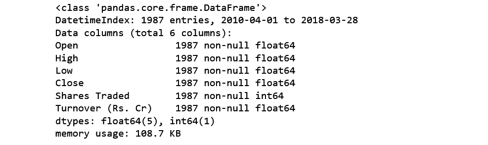

<u>Tools Used
</u>
===
1. *Programming language* : **Python**
2. *Libraries* : **pandas**, **numpy**, **matplotlib**, **statsmodels**, **sklearn**, **seaborn** 
4. **Jupyter notebook** 
5. **Git bash** and **Github**

---

<u>**Introduction**</u>

================================

##  <u>Different Types of data </u>-

+ <u>**Cross-sectional data**</u> : Cross sectional data can obtained by taking multiple observation from multiple individuals at same point in time.
+ <u>**Timeseries data**</u> : Timeseries data can obtained by taking multiple observations from same source at different points of time.
+ <u>**Panel data**</u> : Panel data is collection of multiple observations over multiple points in time. It is combination of cross-sectional data and Time-series data. 

---
## <u>Introduction of dataset</u> :

+ The **Nifty50** data that used is Time series data from **APR-2010** to **MAR-2018**.
+ In this dataset we have 
    -   DatetimeIndex
    -   6 columns
    - 1987 entries in each column 
    - No null values

---

<u>Internal structure of time series</u>

====

A Time series is a combination of General trend, Seasonality, Cyclic movements and Unexpected variations.

+ A timeseries can be expressed as xt = ft + st + ct + et

Where,

+  ft is Trend component 
+  st is Seasonal component
+  ct is cyclic component
+  et is irregular component
+  t is the time index at which observations about the series have been taken

---

+ <u>**General Trend**</u> : When there is Upward or downward movement present in data in a long run, is Known as general trend.

---
+ <u>**Seasonality**</u> : If repetitive patterns present in data which occurs over known periods of time are known as seasonality. Mostly, presence of seasonality can be reveals by exploratory data analysis.

+ <u>**Cyclical movements**</u> : If there are movements observes after every few units of time and do not have fixed periods of variations are known as cyclic movements.

+ <u>**Unexpected variations**</u> : Occurance of sudden changes in time series which are rarely repeted. This component also known as residuals.

---

<u>Stationary time series</u>

===

A timeseries is known as stationary when it is free from Trend and seasonility. Its statistical properties like mean, variance, autocorrelation etc are constant over time.
+ <u>**check stationarity of timeseries**</u> : To check stationarity of timeseries we can-
    1. **Plot Rolling statistics of timeseries**
    2. **Apply Augmented Dickey Fuller test**
---
+ By plotting Rolling statistics we can easily identify trend component.

---
+ Augmented Dickey fuller test is statistical test to check the stationarity of timeseries. It uses null hypothesis testing where H0 rejected if p-value is greater than 0.05.

---

<u>Methods to detrending data
</u>
===

1. Differencing
2. Regression
3. Statistical function

+ **<u>Differencing</u>** : Differencing is processs of taking difference original timeseries with itself by lag.
	example of time series with lag 1 -
	> &Delta;xt = xt - xt-1

	Where, &Delta;xt is stationary time series.
	xt is original time series.
	xt-1 is time series with lag 1.
---

---

+ **<u>Regression</u>** : Regression is useful to find trend line and to remove trend component, take difference between original time series and trend line.

---
+  After removing trend we will get Residuals.

---

+  **<u>Statistical function</u>** : In python a function named `seasonal_decompose` is present in library `statsmodels.tsa.seasonal` which separate Observed data(i.e. original data), trend component, seasonal component and residuals. 

---

<u>Remove seasonality
</u>
===
+ While removing trend by using differencing, seasonality was also removed.
+ `seasonal_decompose()` function return seasonal component also that can be access by `Result.seasonal`.
+ To remove seasonality, if regression is used to detrending data, take average of detrended data for specific season.

---

<u>Forecasting</u>

===

There are many Statistical models for timeseries forecasting. Among them ARIMA is widely used model which is combination of Autoregressive,Integration(differencing) and Moving average models.

+ **<u>Autoregression</u>** : This model gives output which depends on its own previous values.
+ **<u>Differencing</u>** : Integration or differencing makes series sattionary.
+ **<u>Moving Average</u>** : This model analyze data points by creating series of averages of subsets of data.
---

+ ARIMA models are generally denoted by ARIMA(p,d,q)  
where,
+ p is order(no. of time lags) of Autoregressive term.
+ d is the order of differencing(the number of times the data have had past values subtracted).
+ q is the order of moving average model.

Value of p and q is selected by autocorrelation plot partial autocorrelation plot.
+ The value of p will be the lag value where the PACF chart crosses the upper confidence interval for the first time.
+ The value of q will be the lag value where the ACF chart crosses the upper confidence interval for the first time. 

---
+ After fitting model  .forecast() method is used.

---

+ The accuracy of ARIMA model depends on the value of r2. 
+ In statistics r2 is known as cofficient of determination which is square of correlation Coefficient. 
+ Best possible r2 can be 1.0
+ r2 can be negative because the model can be worse.
+ In python r2 can be calculated usong `.r2_score()` method which is present in `sklearn.metrics` package.