# <center>Introduction</center>
## <u>Different Types Of Dataset</u>
1. <u>Cross-sectional data</u> :
Cross sectional data can obtained when there is multiple observations is taken from multiple individuals at same point time. In case of cross sectional data Time does not play any important role in analysis. Analysis of cross sectional data starts with visualization of basic statistical properties i.e. central tendency, dispersion, skewness, kurtosis.

2.  <u>Time series data</u> :
Timeseries data can obtained when there is multiple observations is taken form same source at different points of time. Time series data can be
describe by trend, seasonality, stationarity, autocorrelation, and so on.

3. <u> Panel data</u> :
Panel data is collection of multiple entities over multiple
points in time. Panel data also known as longitudinal data.

*Here we have Nifty50 data from Apr-2010 to Mar-2018*
>    https://www.nseindia.com/products/content/equities/indices/historical_index_data.htm

This is time series data with the frequency of business days.

First we need to explore the data to check the presence of null values
```python
import pandas as pd
Nifty_data=pd.read_csv("E:/summer/NIFTY50.csv",parse_dates=['Date'],index_col=['Date'])
Nifty_data.info()
```


Let’s understand the arguments one by one :

**<u>parse_dates</u>** : This specifies the column which contains the date-time information. As we say above, the column name is 'date'.

**<U>index_col</U>** : This argument tells pandas to use the ‘date’ column as index.

In this dataset we have DateTime series as index and 6 columns, 1987 entries for each. 5 of them are float and one is integer type
also we don't have any Null values.


# <center>Internal structure of Timeseries</center>

A time series is combination of trend, seasonal, cyclical, and irregular components

+ <u>***General trend***</u> :
A general trend can be identify by it's upward or downward movement in a long run.
General trend can be seen with plotting the data, here we are using matplotlib library to plot Close prices.
```python
import matplotlib.pyplot as plt
plt.plot(Nifty_data.Close)
plt.title('Nifty50 data for Close prices')
plt.show()
```


The graph is showing movement in upward direction, this is clear sign of presence of trend component.

**General trend might not capable of being noticed during short run of time series
.**
+ ***<u>Seasonality***</u> :
If in time series data, there are patterns that repeat over known periods of time. For example the consumption of ice-cream during summer is more than winter and hence an ice-cream dealer's sales would be higher in summer months. Mostly, presence of seasonality can be reveals by exploratory data analysis.

+ ***<u>Cyclical movements***</u> :
If there are movements observe after every few units of time, but they are not as frequent as seasonal components, are known as Cyclic components. cyclic components do not have fixed periods of variations.

+ ***<u>Unexpected variations***</u> :
These are sudden changes occurring in a time series which are unlikely to be repeated. They are components of a time series which cannot be explained by trends, seasonal or cyclic movements. These variations are sometimes called residual or random components. These variations, though accidental in nature, can cause a continual change in the trends, seasonal and cyclical oscillations during the forthcoming period.

*The objective of time series analysis is to decompose timeseries into it's elements and develop mathematical models to predict future values.*


# <center>Stationary time series</center>

When a time series free from general trend and seasonality, it become stationary. Statistical properties like mean, variance, autocorrelation etc. of an stationary time series remains constant over time. It is important to gain stationarity before forecasting because most statistical forecasting methods are applicable on stationary
time series.

we can check stationarity using the following:
1. **<u>Plotting rolling statistics</u>** : we can plot moving mean and moving variance  and see if these terms are varying with time. let's plot the moving average for business week days, business month days , Quarterly and yearly.
we have .rolling() method in pyhon to calculate rolling statistics.
  +  weekly
  ```Python
  plt.plot(Nifty_data.Close,label='Close Prices',color='green')
plt.plot(Nifty_data['Close'].rolling(window=5).mean(),label='moving avg',color='orange')
plt.legend()
plt.title('Weekly rolling statistics')
plt.show()
  ```

  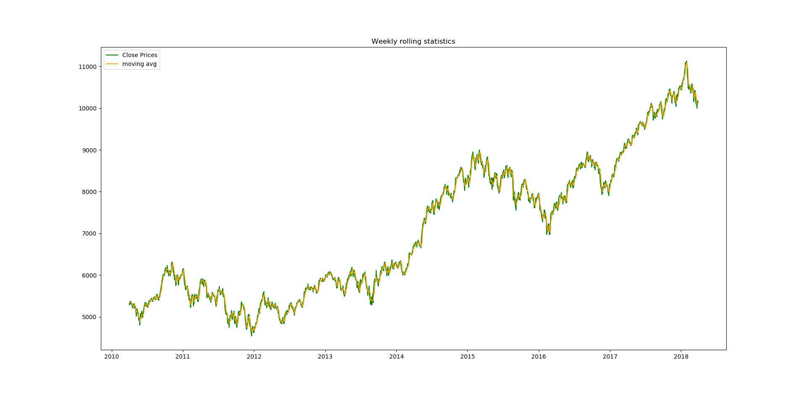
  + Monthly
  ```python
  plt.plot(Nifty_data.Close,label='Close Prices',color='green')
plt.plot(Nifty_data['Close'].rolling(window=21).mean(),label='moving avg',color='orange')
plt.legend()
plt.title('Monthly rolling statistics')
plt.show()
```

  

  + Quarterly
  ```python
  plt.plot(Nifty_data.Close,label='Close Prices',color='green')
plt.plot(Nifty_data['Close'].rolling(window=63).mean(),label='moving avg',color='orange')
plt.legend()
plt.title('Quarterly rolling statistics')
plt.show()
```

  

  + yearly
  ```Python
  plt.plot(Nifty_data.Close,label='Close Prices',color='green')
plt.plot(Nifty_data['Close'].rolling(window=252).mean(),label='moving avg',color='orange')
plt.legend()
plt.title('Yearly rolling statistics')
plt.show()
```

  

  *As we can see moving average is changing with time so, Time series is not stationary.*

2. **<u>Augmented Dickey Fuller test</u>** : This is one of the unit root tests for checking stationarity. In this this test we check for null hypothiesis, where H<sub>0</sub> stats that time series is stationary whereas H<sub>A</sub> stats that time series is not Stationary.
In python we have stattools.adfuller function to check the stationarity of time series.
```python
from statsmodels.tsa.stattools import adfuller
stnry_test=adfuller(Nifty_data['Close'],autolag='AIC')
stnry_rslt = pd.Series(stnry_test[0:4], index=['Test Statistic','p-value','#Lags Used','Number of Observations Used'])
for key,value in stnry_test[4].items():
    stnry_rslt['Critical Value (%s)'%key] = value
print(stnry_rslt)
if(stnry_test[1]>0.05):
    print("Time Series is not stationary")
else:
    print("Time series is stationary")
```


**Note - ** if p-value is greater than 0.05 reject null hypothesis.

Here, p-value is **0.914701** which is greater than **0.05**.
Hence it is confirmed that our time series is not stationary.


To get stationary time series we need to remove trend and seasonality.


### <center>**<u>Methods to detrending data</u>**</center>
A time series can be detrended using following methods -
  + Differencing  
  + Regression
  + using functions


1. **<u>Method to detrending timeseries using Differencing</u>** :
Differencing is the process of taking difference between successive occurrence  of time series &Delta;x<sub>t</sub> = x<sub>t</sub> - x<sub>t-1</sub>.

Where, &Delta;x<sub>t</sub> is stationary time series.

x<sub>t</sub> is original time series.

x<sub>t-1</sub> is time series with lag 1.

In python we have .shift() method to create a series with lag.

```Python
diff=Nifty_data['Close']-Nifty_data['Close'].shift(1)
```
There will be null values because of lag. It is important to remove null values otherwise adfuller test function will show an error i.e. `"SVD did not converge"`
```Python
diff.dropna(inplace=True)
```

*lets plot rolling statistics*
```Python
plt.plot(diff,label='differenced timeseries',color='grey')
plt.plot(diff.rolling(window=252).mean(),label='Moving average',color='red')
plt.title('Yearly rolling statistics on diffrenced time series')
plt.axhline(y=0,color='green')
plt.legend()
plt.show()
```


Now, the moving average is constant.

We can confirm the stationarity by apply Augmented DickeyFullerTest on `diff` time series -
```Python
stnry_test_diff=adfuller(diff,autolag='AIC')
stnry_rslt_diff = pd.Series(stnry_test_diff[0:4], index=['Test Statistic','p-value','#Lags Used','Number of Observations Used'])
for key,value in stnry_test[4].items():
    stnry_rslt_diff['Critical Value (%s)'%key] = value
print(stnry_rslt_diff)
if(stnry_test_diff[1]>0.05):
    print("Time Series is not stationary")
else:
    print("Time series is stationary")
```


**p-value is 0.000000 which is less than 0.05.**

So, the time series is now stationary.

The method of differencing discussed above is first order differencing. After applying first order differencing It is possible that the time series may not become stationary then we have to perform second order differencing. To perform second order differencing, take difference another time.
> x&prime;<sub>t</sub> - x&prime;<sub>t-1</sub> = (x<sub>t</sub> - x<sub>t-1</sub>) - (x<sub>t-1</sub> - x<sub>t-2</sub>) = x<sub>t</sub> - 2x<sub>t-1</sub> - x<sub>t-2</sub>

This was the first method of making a time series stationary.


2. **<u>Method to detrening timeseries using Regression</u>** :
Regression is another way to detrending timeseries data. Objective of choosing regression over differencing is to get trend line. Trend line can later be used as prediction of long run movement of time series.

Regression analysis is a form of predictive modeling technique which looks into the relationship between a target and predictor variables. Regression analysis is used for forecasting, time series modeling.

Here we fit a trend line to the training data, in such a manner that the distance between data points and trend line is minimum.

lets perform linear regression, but first we have to separate training data and testing data
```Python
# separating training and testing data
train = Nifty_data['Close'].iloc[:1750]
test = Nifty_data['Close'].iloc[1751:]
# building linear model
import numpy as np
from sklearn import linear_model
lm = linear_model.LinearRegression(normalize=True, fit_intercept=True)
```
##### Details of parameters :
1. **Normalize** :
This parameter is ignored when `fit_intercept` is set to False. If True, the regressors X will be normalized before regression. By default this is set to False.
2. **fit_intercept** :
whether to calculate the intercept for this model. If set to False, no intercept will be used in calculations. By default this is set to True.

For more information about parameters you can see LinearRegression documentation.

http://scikit-learn.org/stable/modules/generated/sklearn.linear_model.LinearRegression.html#sklearn.linear_model.LinearRegression

Now we have to fit linear_model to Nifty_data timeseries
```Python
lm.fit(np.arange(np.array(len(train.index))).reshape((-1,1)), train)
```
Now lets check the accuracy of fitted model

```python
lm.score(np.arange(np.array(len(train.index))).reshape((-1,1)), train)
```


Now, we are going to plot close prices with trend line
```python
plt.plot(Nifty_data['Close'],label='Original data')
plt.plot(pd.Series(lm.predict(np.arange(np.array(len(Nifty_data.index))).reshape((-1,1))),index=Nifty_data.index),label='Trend line')
plt.title('Close prices with trend line')
plt.legend()
plt.show()
```
Output will be -


Now we are going to calculate residuals which will be used later in forecasting
```python
Residuals=Nifty_data['Close']-lm.predict(np.arange(np.array(len(Nifty_data.index))).reshape((-1,1)))
plt.plot(pd.Series(Residuals,index=Nifty_data.index),label=Residuals)
plt.title('Residuals for Close prices')
plt.show()
```
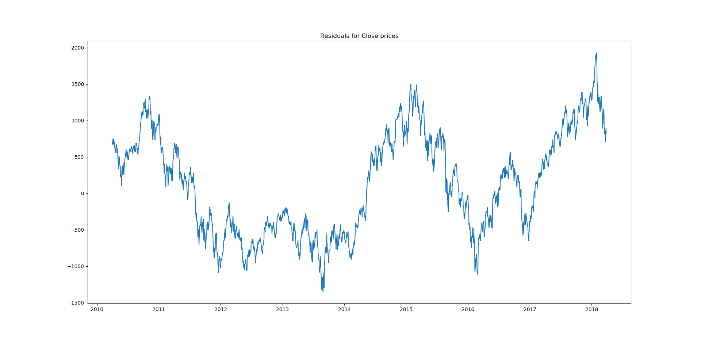


3. **<u>Method to detrending timeseries using Functions</u>** :
There are many libraries in python which are specially made to perform Statistical operations, one of them is `statsmodels`.

```python
from statsmodels.tsa import seasonal
decompose = seasonal.seasonal_decompose(Nifty_data['Close'],freq=252)
```   
`seasonal_decompose()` method returns,
+ Observed data (i.e. Close prices from `Nifty_data` dataset)
+ Trend components
+ Seasonal components
+ Residuals

We can access Trend, seasonal components and Residuals by `decompose.trend`, `decompose.seasonal`, `decompose.resid` respectively.

**<u>Note</u>** :
*Because we use 252 as frequency so we will have 252 null values in trend component and in residuals*

```python
decompose.trend.dropna(inplace=True)
decompose.resid.dropna(inplace=True)
```
Now, we are going to plot trend component.

```python
decompose.trend.plot()
plt.title('Trend Component')
plt.show()
```


We detrended our time series now it's time to do work on seasonality.

### **<u>Estimating seasonality</u>**

*while removing trend by using  differencing, seasonality was also removed so if we perform differencing method trend and seasonality both will removed*

*while applying `seasonal_decompose` method we already get the seasonal component.*

so  there is no need to perform any other operation to remove seasonality if we follow differencing or use statsmodels package. If we use regression then we don't get anything related to seasonality. So we have to perform exploratory data analysis through following plots :
+ Run sequence plot
+ Seasonal subseries plot
+ Multiple box plot

> **To remove Seasonality, simply take average of detrended data for specific season.**

In these plot we will use Residuals -
```Python
Residuals = Nifty_data['Close'] - lm.predict(np.arange(np.array(len(Nifty_data.index))).reshape((-1,1)))
```

# **<u>Run sequence plot</u>** :
A simple time series plot wit time on x-axis itself reveals following properties :
1. Movement in mean of series
2. Shifts in variance
3. presence of outliers

lets viusualize :
+ Monthly
```python
plt.plot(Residuals.rolling(window=21).mean(),label='residual mean')
plt.plot(Residuals.rolling(window=21).std(),label='residual std')
plt.plot(Residuals,label='Residuals')
plt.xlabel('year')
plt.ylabel('Residuals')
plt.title('Residuals,Monthly mean and Monthly Std ')
plt.legend()
plt.show()
```


+ Quarterly

```Python
plt.plot(Residuals.rolling(window=63).mean(),label='residual mean')
plt.plot(Residuals.rolling(window=63).std(),label='residual std')
plt.plot(Residuals,label='Residuals')
plt.xlabel('year')
plt.ylabel('Residuals')
plt.title('Residuals,Quarterly mean and Quarterly Std ')
plt.legend()
plt.show()
```
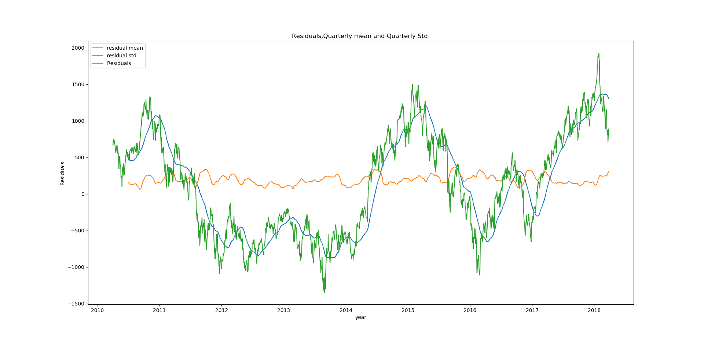

+ yearly

```python
plt.plot(Residuals.rolling(window=252).mean(),label='residual mean')
plt.plot(Residuals.rolling(window=252).std(),label='residual std')
plt.plot(Residuals,label='Residuals')
plt.xlabel('year')
plt.ylabel('Residuals')
plt.title('Residuals,Yearly mean and Yearly Std ')
plt.legend()
plt.show()
```


# **<u>Seasonal sub series plot</u>** :
We can identify seasonality by groping time periods like month, quarter or year. this method is only useful when time period of seasonality is known.

before plotting lets add columns for Residuals, months, quarter and years.
+ Adding column "Residuals"
```Python
Nifty_data['Residuals']=Residuals
```

+ Adding column "month"   
```python
Nifty_data['month']=Nifty_data.index.map(lambda x:x.month)
```

+ Adding column "year"
```python
Nifty_data['year']=Nifty_data.index.map(lambda x:x.year)
```

+ Adding column "quarter"
```Python
month_quarter_map = {1: 'Q1', 2: 'Q1', 3: 'Q1',
                     4: 'Q2', 5: 'Q2', 6: 'Q2',
                     7: 'Q3', 8: 'Q3', 9: 'Q3',
                     10: 'Q4', 11: 'Q4', 12: 'Q4'
                    }
Nifty_data['quarter'] = Nifty_data['month'].map(lambda m: month_quarter_map.get(m))
```

Now we are going to calculate mean and standard deviation for residuals and making a new subseries. we already calculated residuals while detrending data using regression.

+ quarterly
```python
# Creating new subseries
sub_series_quarterly = Nifty_data.groupby(by=['year', 'quarter'])['Residuals'].aggregate([np.mean, np.std])
sub_series_quarterly.columns = ['Quarterly Mean Close', 'Quarterly Standard Deviation Close']
#Create row indices of seasonal_sub_series_data using Year & Quarter
sub_series_quarterly.reset_index(inplace=True)
sub_series_quarterly.index = sub_series_quarterly['year'].astype(str) + '-' + sub_series_quarterly['quarter']
```
Lets have a look to our sub series :
```Python
sub_series_quarterly.head()
```


Now we are going to plot it -

```Python
sub_series_quarterly['Quarterly Mean Close'].plot(color='b')
plt.title('Quarterly Mean of Residuals')
plt.ylabel('Residuals')
plt.show()
sub_series_quarterly['Quarterly Mean Close'].plot()
plt.title('Quarterly standard Deviation of Residuals')
plt.show()
```
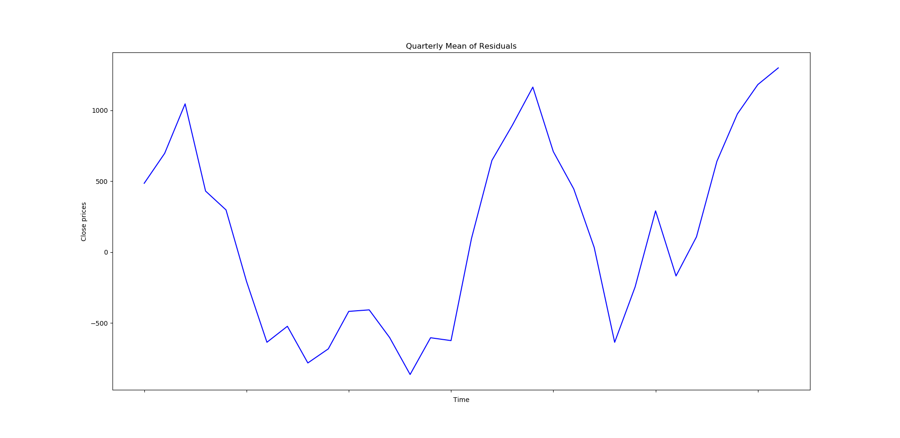


+ Monthly
```Python
# Creating new subseries
sub_series_Monthly = Nifty_data.groupby(by=['month'])['Residuals'].aggregate([np.mean, np.std])
sub_series_Monthly.columns = ['monthly Mean', 'monthly Standard Deviation']
# plotting sub series
sub_series_Monthly['monthly Mean'].plot()
plt.title('Monthly mean of residuals')
plt.show()
sub_series_Monthly['monthly Standard Deviation'].plot()
plt.title('Monthly Standard Deviation of residuals')
plt.show()
```
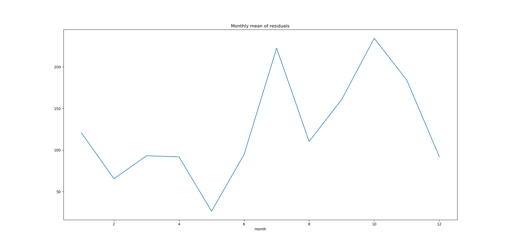
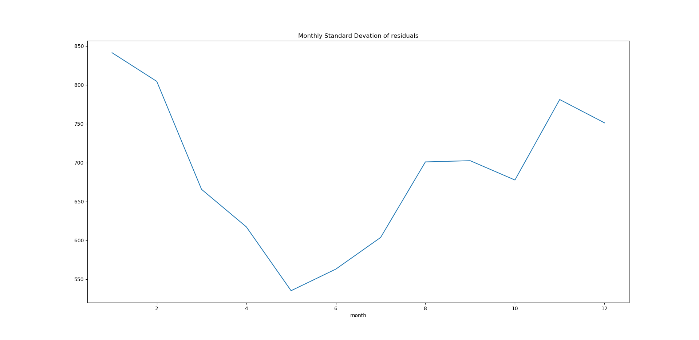

+ Yearly
```Python
# Creating new subseries
sub_series_yearly = Nifty_data.groupby(by=['year'])['Residuals'].aggregate([np.mean, np.std])
sub_series_yearly.columns = ['yearly Mean', 'yearly Standard Deviation']
# plotting sub series
sub_series_yearly['yearly Mean'].plot()
plt.title('yearly mean of residuals')
plt.show()
sub_series_yearly['yearly Standard Deviation'].plot()
plt.title('Yearly Standard Devation of residuals')
plt.show()
```
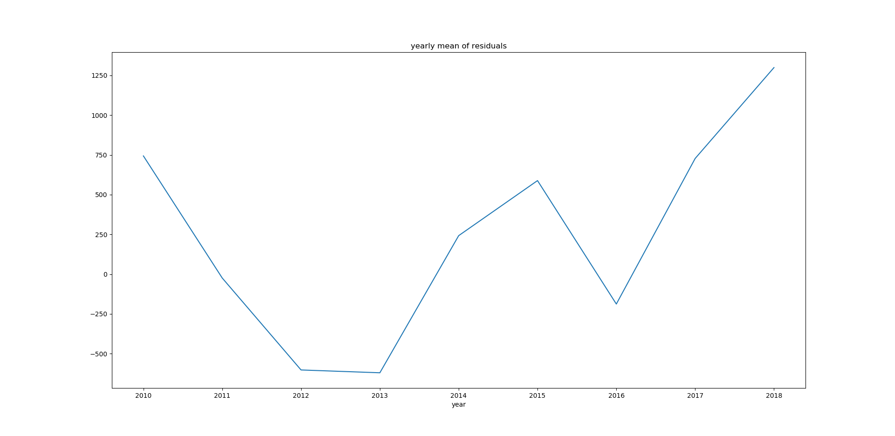
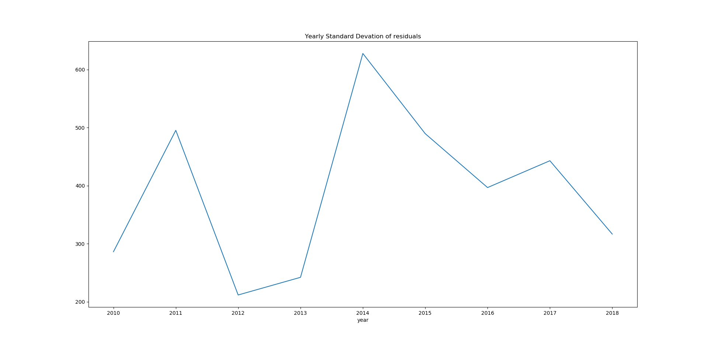


# **<u>Multiple box plots</u>** :
Multiple box plots are basically the boxplots of seasonal subseries plots. Box plots are more informative than any simple plot. Box plot revels information like mean, inter quartile range, minimum and maximum value and outliers, central tendency and dispersion.

For box plots we are going to use `seaborn`.

+ Quarterly

```Python
# Multiple Boxplot(Quarterly)
import seaborn as sns
plt.figure(figsize=(5.5, 5.5))
g = sns.boxplot(data=Nifty_data[['Residuals','quarter']], y=Nifty_data['Residuals'], x=Nifty_data['quarter'])
g.set_title('Quarterly box plot of Residuals')
g.set_xlabel('Time')
g.set_ylabel('Residuals')
plt.show()
```
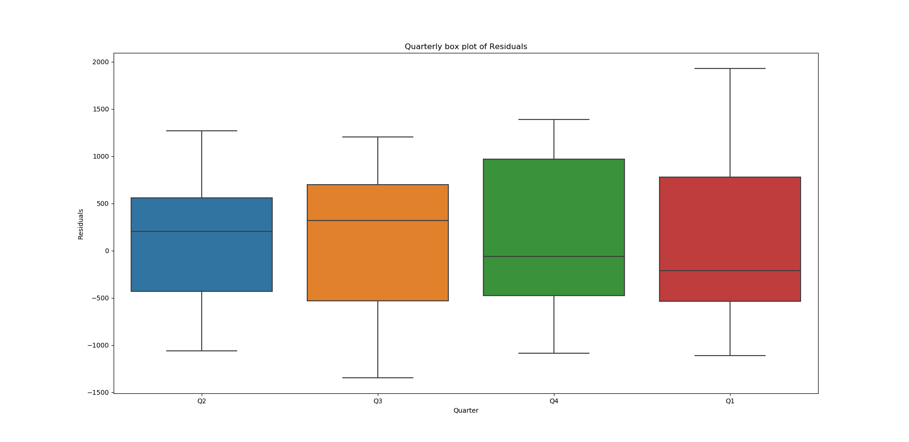

+ Monthly
```Python
# Multiple Boxplot(Monthly)
import seaborn as sns
plt.figure(figsize=(5.5, 5.5))
g = sns.boxplot(data=Nifty_data[['Residuals','month']], y=Nifty_data['Residuals'], x=Nifty_data['month'])
g.set_title('Monthly box plot of Residuals')
g.set_xlabel('Time')
g.set_ylabel('Residuals')
plt.show()
```
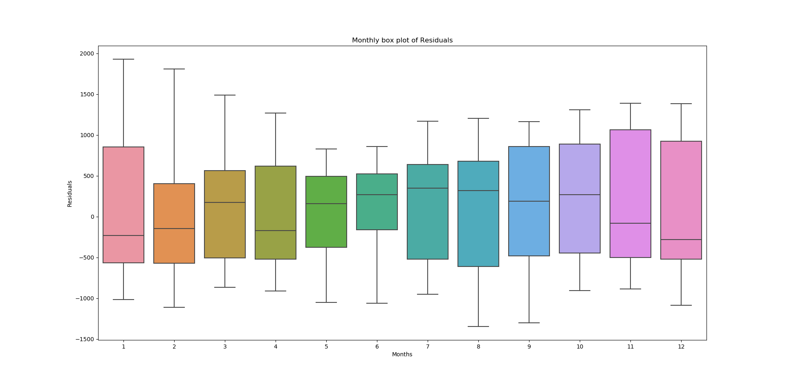

+ Yearly
```python
# Multiple Boxplot(Yearly)
import seaborn as sns
plt.figure(figsize=(5.5, 5.5))
g = sns.boxplot(data=Nifty_data[['Residuals','year']], y=Nifty_data['Residuals'], x=Nifty_data['year'])
g.set_title('Yearly box plot of Residuals')
g.set_xlabel('Time')
g.set_ylabel('Residuals')
plt.show()
```
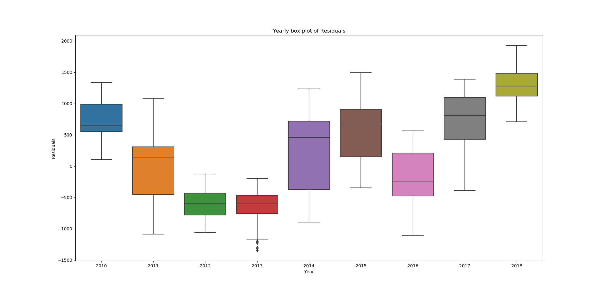


These are the methods to estimating seasonality.
*****************************************************************
# <center><u>Forecasting</u></center>

For Time series forecasting ARIMA model is popular and widely used statistical method.
ARIMA is an acronym of AutoRegressive Integrated Moving Average. It is generalization of AutoRegressive Moving Average and differencing.
+ **AR** *(AutoRegression)*: This technique can be used on time series where output variable depends on its own previous values.

+ **I** *(integrated)* : This is order of differencing to make time series stationary.  

+ **MA** *(Moving Average)* : A model that analyze data points by creating series of averages of subsets of data.

The ARIMA(p,d,q) represents the order of AR term, Differencing order and MA term respectively

To find the value of p and q we will plot autocorrelation and partial autocorrelation functions.

```Python
from statsmodels.tsa.stattools import acf, pacf
# ACF plot
lag_acf=acf(diff,nlags=20)
lag_pacf=pacf(diff,nlags=20,method='ols')
# plot ACF
plt.plot(lag_acf)
plt.axhline(y=0,linestyle='--',color='gray')
plt.axhline(y=-1.96/np.sqrt(len(diff)),linestyle='--',color='gray')
plt.axhline(y=1.96/np.sqrt(len(diff)),linestyle='--',color='gray')
plt.title('Autocorrelation Function')
plt.show()
# plot PACF
plt.plot(lag_pacf)
plt.axhline(y=0,linestyle='--',color='gray')
plt.axhline(y=-1.96/np.sqrt(len(diff)),linestyle='--',color='gray')
plt.axhline(y=1.96/np.sqrt(len(diff)),linestyle='--',color='gray')
plt.title('Partial Autocorrelation Function')
plt.show()
```
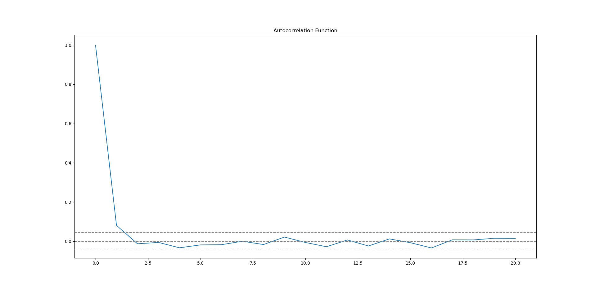
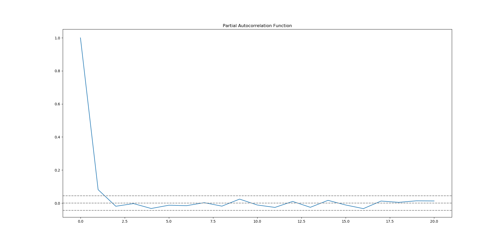

In these plots we draw the dotted line at y=0 and confidence intervals (dotted lines).
1. The value of p will be the lag value where the PACF chart crosses the upper confidence interval for the first time. In our plot it is 2.
2. The value of q will be the lag value where the ACF chart crosses the upper confidence interval for the first time. In our plot it is also 2.

Time series forecasting can be done in two ways :
  1. We can calculate fitted values from model and take it back to original time series scale
  2. Use .forecast() function on ARIMAresults, which performs one step forcast using the model.

### Forecasting without using .forecast() function

```Python
from statsmodels.tsa.arima_model import ARIMA
# seperating training and testing data
train=Nifty_data['Close'].iloc[:1750]
test=Nifty_data['Close'].iloc[1751:]
# Building ARIMA model
model = ARIMA(Nifty_data['Close'], order=(2, 1, 2))  
results_ARIMA = model.fit()

# taking it back to original scale
predict_Arima=pd.Series(results_ARIMA.fittedvalues, copy=True)
predict_Arima.head()
```
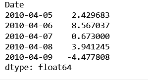

The first element of our original time series is lost because we took a lag by 1.
to convert the differencing to log scale we will first determine the cumulative sum at index and then add it to the base number.
```Python
predict_Arima_cumsum=predict_Arima.cumsum()
predict_Arima_data=pd.Series(Nifty_data['Close'].iloc[0], index=Nifty_data.index)
predict_Arima_data=predict_Arima_data.add(predict_Arima_cumsum,fill_value=0)
predict_Arima_data.head()
```
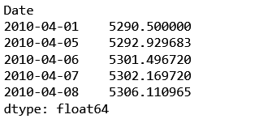

Now the series is on its original scale.

```Python
plt.plot(Nifty_data['Close'],label='Close prices')
plt.plot(predict_Arima_data,label='predicted values')
plt.legend()
plt.show()
```
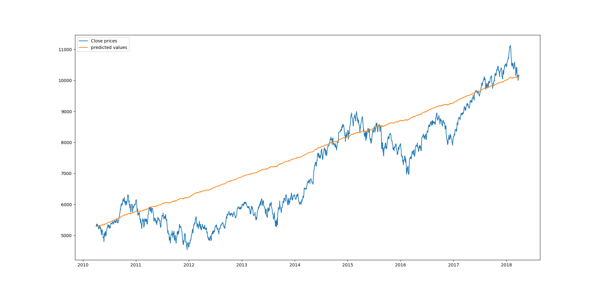

code to calculate score -
```Python
import sklearn.metrics
sklearn.metrics.r2_score(Nifty_data['Close'],predict_Arima_data)
```
The score is : 0.7398187397952602

### Forecasting using .forecast() function

```Python
training_set = [x for x in train]
predictions = []
for i in range(len(test)):
    model = ARIMA(training_set, order=(2,1,2))
    model_fit = model.fit()
    output = model_fit.forecast()
    predictions.append(output[0])
    obs = test[i]
    training_set.append(obs)
    print('predicted=%f, expected=%f' % (output[0], obs))
```
Sample of output is :

<center>

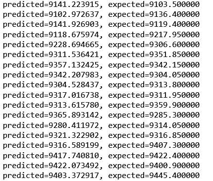

</center>

Plot of predicted values with test data :

```Python
pred=pd.Series(predictions,index=test.index)
plt.plot(test,label='Test data')
plt.plot(pred, color='red',label='Predicted values')
plt.title('Test data VS. Predicted values')
plt.legend()
plt.show()
```
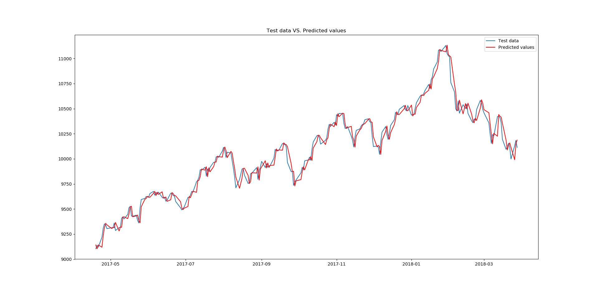

R2 Score -
```python
sklearn.metrics.r2_score(test,pred)
```
The Score is : 0.9777090172770078
