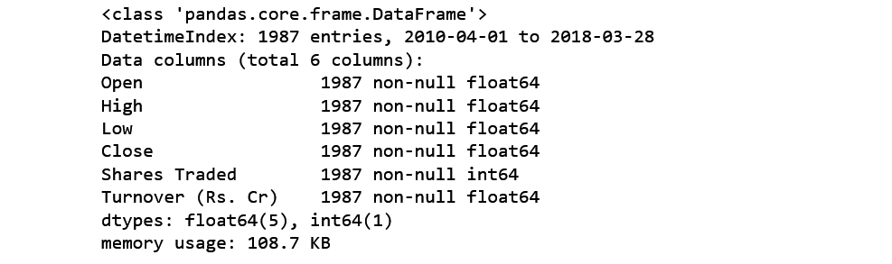
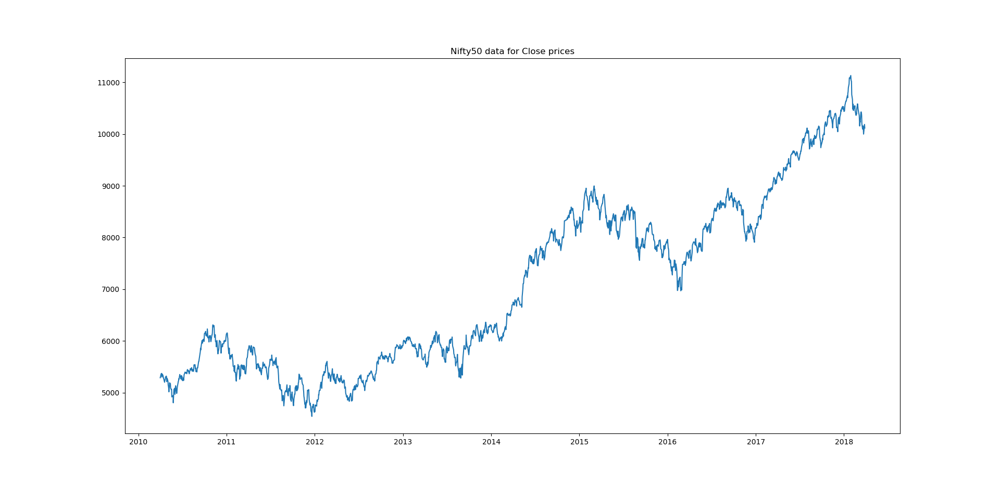
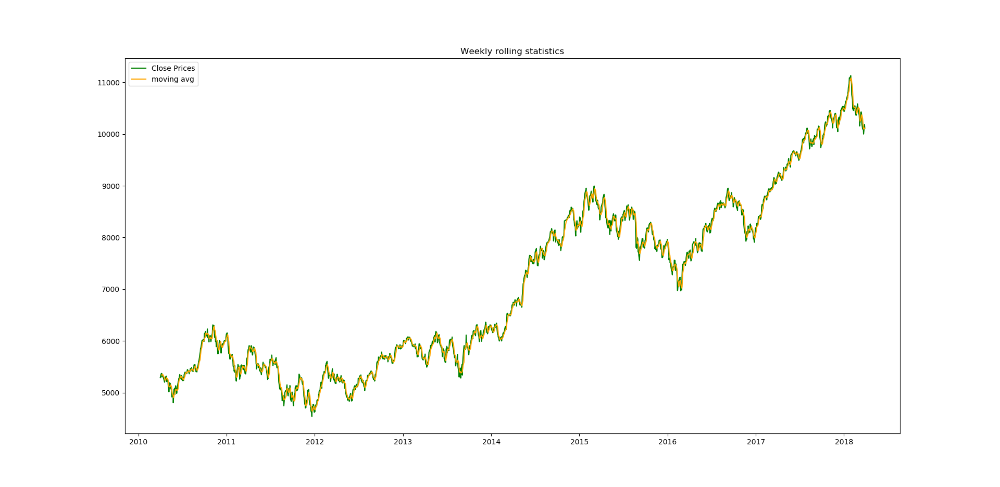
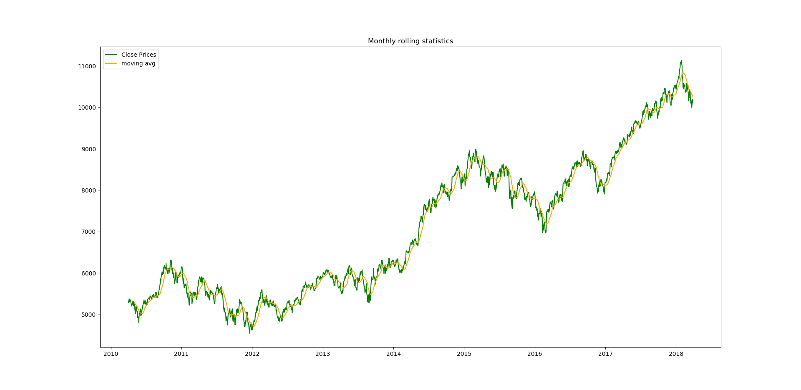
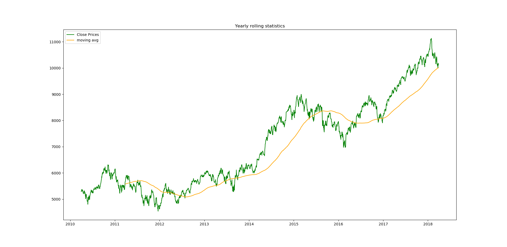
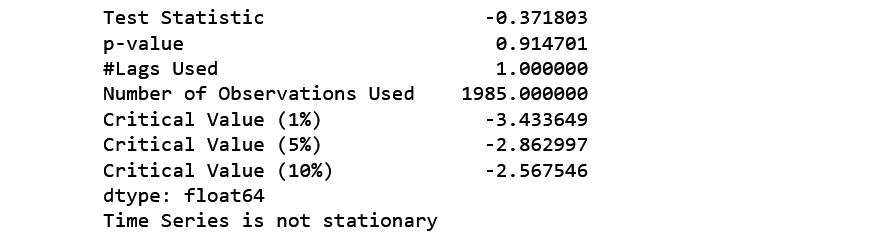
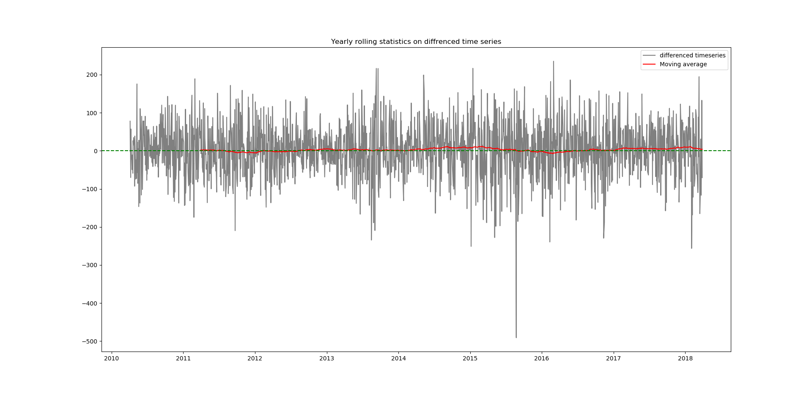
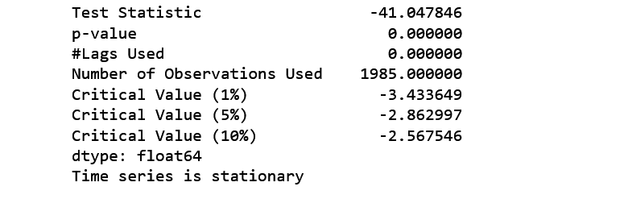

<<<<<<< HEAD
# <center>Introduction</center>
## <u>Different Types Of Dataset</u>
1. <u>Cross-sectional data</u> :
Cross sectional data can obtained when there is multiple observations is taken from multiple individuals at same point time. In case of cross sectional data Time does not play any important role in analysis. Analysis of cross sectional data starts with visualization of basic statistical properties i.e. central tendency, dispersion, skewness, kurtosis.

2.  <u>Time series data</u> :
Timeseries data can obtained when there is multiple observations is taken form same source at different points of time. Time series data can be
describe by trend, seasonality, stationarity, autocorrelation, and so on.

3. <u> Panel data</u> :
Panel data is collection of multiple entities over multiple
points in time. Panel data also known as longitudinal data.

*Here we have Nifty50 data from Apr-2010 to Mar-2018*
>    https://www.nseindia.com/products/content/equities/indices/historical_index_data.htm

This is time series data with the frequency of business days.

First we need to explore the data to check the presence of null values
```python
import pandas as pd
Nifty_data=pd.read_csv("E:/summer/NIFTY50.csv",parse_dates=['Date'],index_col=['Date'])
Nifty_data.info()
```


Let’s understand the arguments one by one :

**<u>parse_dates</u>** : This specifies the column which contains the date-time information. As we say above, the column name is 'date'.

**<U>index_col</U>** : This argument tells pandas to use the ‘date’ column as index.

In this dataset we have DateTime series as index and 6 columns, 1987 entries for each. 5 of them are float and one is integer type
also we don't have any Null values.


# <center>Internal structure of Timeseries</center>

A time series is combination of trend, seasonal, cyclical, and irregular components

+ <u>***General trend***</u> :
A general trend can be identify by it's upward or downward movement in a long run.
General trend can be seen with plotting the data, here we are using matplotlib library to plot Close prices.
```python
import matplotlib.pyplot as plt
plt.plot(Nifty_data.Close)
plt.title('Nifty50 data for Close prices')
plt.show()
```



The graph is showing movement in upward direction, this is clear sign of presence of trend component.

**General trend might not capable of being noticed during short run of time series
.**
+ ***<u>Seasonality***</u> :
If in time series data, there are patterns that repeat over known periods of time. For example the consumption of ice-cream during summer is more than winter and hence an ice-cream dealer's sales would be higher in summer months. Mostly, presence of seasonality can be reveals by exploratory data analysis.

+ ***<u>Cyclical movements***</u> :
If there are movements observe after every few units of time, but they are not as frequent as seasonal components, are known as Cyclic components. cyclic components do not have fixed periods of variations.

+ ***<u>Unexpected variations***</u> :
These are sudden changes occurring in a time series which are unlikely to be repeated. They are components of a time series which cannot be explained by trends, seasonal or cyclic movements. These variations are sometimes called residual or random components. These variations, though accidental in nature, can cause a continual change in the trends, seasonal and cyclical oscillations during the forthcoming period.

*The objective of time series analysis is to decompose timeseries into it's elements and develop mathematical models to predict future values.*


# <center>Stationary time series</center>

When a time series free from general trend and seasonality, it become stationary. Statistical properties like mean, variance, autocorrelation etc. of an stationary time series remains constant over time. It is important to gain stationarity before forecasting because most statistical forecasting methods are applicable on stationary
time series.

we can check stationarity using the following:
1. **<u>Plotting rolling statistics<u>** : we can plot moving mean and moving variance  and see if these terms are varying with time. let's plot the moving average for business week days, business month days , Quarterly and yearly.
we have .rolling() method in pyhon to calculate rolling statistics.
  +  weekly
  ```Python
  plt.plot(Nifty_data.Close,label='Close Prices',color='green')
plt.plot(Nifty_data['Close'].rolling(window=5).mean(),label='moving avg',color='orange')
plt.legend()
plt.title('Weekly rolling statistics')
plt.show()
  ```

  
  + Monthly
  ```python
  plt.plot(Nifty_data.Close,label='Close Prices',color='green')
plt.plot(Nifty_data['Close'].rolling(window=21).mean(),label='moving avg',color='orange')
plt.legend()
plt.title('Monthly rolling statistics')
plt.show()
```

  

  + Quarterly
  ```python
  plt.plot(Nifty_data.Close,label='Close Prices',color='green')
plt.plot(Nifty_data['Close'].rolling(window=63).mean(),label='moving avg',color='orange')
plt.legend()
plt.title('Quarterly rolling statistics')
plt.show()
```

  

  + yearly
  ```Python
  plt.plot(Nifty_data.Close,label='Close Prices',color='green')
plt.plot(Nifty_data['Close'].rolling(window=252).mean(),label='moving avg',color='orange')
plt.legend()
plt.title('Yearly rolling statistics')
plt.show()
```

  

  *As we can see moving average is changing with time so, Time series is not stationary.*

2. **<u>Augmented Dickey Fuller test</u>** : This is one of the unit root tests for checking stationarity. In this this test we check for null hypothiesis, where H<sub>0</sub> stats that time series is stationary whereas H<sub>A</sub> stats that time series is not Stationary.
In python we have stattools.adfuller function to check the stationarity of time series.
```python
from statsmodels.tsa.stattools import adfuller
stnry_test=adfuller(Nifty_data['Close'],autolag='AIC')
stnry_rslt = pd.Series(stnry_test[0:4], index=['Test Statistic','p-value','#Lags Used','Number of Observations Used'])
for key,value in stnry_test[4].items():
    stnry_rslt['Critical Value (%s)'%key] = value
print(stnry_rslt)
if(stnry_test[1]>0.05):
    print("Time Series is not stationary")
else:
    print("Time series is stationary")
```


**Note - ** if p-value is greater than 0.05 reject null hypothesis.

Here, p-value is **0.914701** which is greater than **0.05**.
Hence it is confirmed that our time series is not stationary.


To get stationary time series we need to remove trend and seasonality.


### **<u>Methods to detrending data</u>** :
A time series can be detrended using following methods -
  + Differencing  
  + Regression
  + using functions


1. **<u>Differencing</u>** :
Differencing is the process of taking difference between successive occurrence  of time series &Delta;x<sub>t</sub> = x<sub>t</sub> - x<sub>t-1</sub>.

Where, &Delta;x<sub>t</sub> is stationary time series.

x<sub>t</sub> is original time series.

x<sub>t-1</sub> is time series with lag 1.

In python we have .shift() method to create a series with lag.

```Python
diff=Nifty_data['Close']-Nifty_data['Close'].shift(1)
```
There will be null values because of lag. It is important to remove null values otherwise adfuller test function will show an error i.e. `"SVD did not converge"`
```Python
diff.dropna(inplace=True)
```

*lets plot rolling statistics*
```Python
plt.plot(diff,label='differenced timeseries',color='grey')
plt.plot(diff.rolling(window=252).mean(),label='Moving average',color='red')
plt.title('weekly rolling statistics on diffrenced time series')
plt.axhline(y=0,color='green')
plt.legend()
plt.show()
```


Now, the moving average is constant.

We can confirm the stationarity by apply Augmented DickeyFullerTest on `diff` time series -
```Python
stnry_test_diff=adfuller(diff,autolag='AIC')
stnry_rslt_diff = pd.Series(stnry_test_diff[0:4], index=['Test Statistic','p-value','#Lags Used','Number of Observations Used'])
for key,value in stnry_test[4].items():
    stnry_rslt_diff['Critical Value (%s)'%key] = value
print(stnry_rslt_diff)
if(stnry_test_diff[1]>0.05):
    print("Time Series is not stationary")
else:
    print("Time series is stationary")
```


**p-value is 0.000000 which is less than 0.05.**

So, the time series is now stationary.

This was the first method of making a time series stationary.
=======
# <center>Introduction</center>
## <u>Different Types Of Dataset</u>
1. <u>Cross-sectional data</u> :
Cross sectional data can obtained when there is multiple observations is taken from multiple individuals at same point time. In case of cross sectional data Time does not play any important role in analysis. Analysis of cross sectional data starts with visualization of basic statistical properties i.e. central tendency, dispersion, skewness, kurtosis.

2.  <u>Time series data</u> :
Timeseries data can obtained when there is multiple observations is taken form same source at different points of time. Time series data can be
describe by trend, seasonality, stationarity, autocorrelation, and so on.

3. <u> Panel data</u> :
Panel data is collection of multiple entities over multiple
points in time. Panel data also known as longitudinal data.

*Here we have Nifty50 data from Apr-2010 to Mar-2018*
>    https://www.nseindia.com/products/content/equities/indices/historical_index_data.htm

This is time series data with the frequency of business days.

First we need to explore the data to check the presence of null values
```python
import pandas as pd
Nifty_data=pd.read_csv("E:/summer/NIFTY50.csv",parse_dates=['Date'],index_col=['Date'])
Nifty_data.info()
```


Let’s understand the arguments one by one :

**<u>parse_dates</u>** : This specifies the column which contains the date-time information. As we say above, the column name is 'date'.

**<U>index_col</U>** : This argument tells pandas to use the ‘date’ column as index.

In this dataset we have DateTime series as index and 6 columns, 1987 entries for each. 5 of them are float and one is integer type
also we don't have any Null values.


# <center>Internal structure of Timeseries</center>

A time series is combination of trend, seasonal, cyclical, and irregular components

+ <u>***General trend***</u> :
A general trend can be identify by it's upward or downward movement in a long run.
General trend can be seen with plotting the data, here we are using matplotlib library to plot Close prices.
```python
import matplotlib.pyplot as plt
plt.plot(Nifty_data.Close)
plt.title('Nifty50 data for Close prices')
plt.show()
```


The graph is showing movement in upward direction, this is clear sign of presence of trend component.

**General trend might not capable of being noticed during short run of time series
.**
+ ***<u>Seasonality***</u> :
If in time series data, there are patterns that repeat over known periods of time. For example the consumption of ice-cream during summer is more than winter and hence an ice-cream dealer's sales would be higher in summer months. Mostly, presence of seasonality can be reveals by exploratory data analysis.

+ ***<u>Cyclical movements***</u> :
If there are movements observe after every few units of time, but they are not as frequent as seasonal components, are known as Cyclic components. cyclic components do not have fixed periods of variations.

+ ***<u>Unexpected variations***</u> :
These are sudden changes occurring in a time series which are unlikely to be repeated. They are components of a time series which cannot be explained by trends, seasonal or cyclic movements. These variations are sometimes called residual or random components. These variations, though accidental in nature, can cause a continual change in the trends, seasonal and cyclical oscillations during the forthcoming period.

*The objective of time series analysis is to decompose timeseries into it's elements and develop mathematical models to predict future values.*


# <center>Stationary time series</center>

When a time series free from general trend and seasonality, it become stationary. Statistical properties like mean, variance, autocorrelation etc. of an stationary time series remains constant over time. It is important to gain stationarity before forecasting because most statistical forecasting methods are applicable on stationary
time series.

we can check stationarity using the following:
1. **<u>Plotting rolling statistics<u>** : we can plot moving mean and moving variance  and see if these terms are varying with time. let's plot the moving average for business week days, business month days , Quarterly and yearly.
we have .rolling() method in pyhon to calculate rolling statistics.
  +  weekly
  ```Python
  plt.plot(Nifty_data.Close,label='Close Prices',color='green')
plt.plot(Nifty_data['Close'].rolling(window=5).mean(),label='moving avg',color='orange')
plt.legend()
plt.title('Weekly rolling statistics')
plt.show()
  ```

  
  + Monthly
  ```python
  plt.plot(Nifty_data.Close,label='Close Prices',color='green')
plt.plot(Nifty_data['Close'].rolling(window=21).mean(),label='moving avg',color='orange')
plt.legend()
plt.title('Monthly rolling statistics')
plt.show()
```

  

  + Quarterly
  ```python
  plt.plot(Nifty_data.Close,label='Close Prices',color='green')
plt.plot(Nifty_data['Close'].rolling(window=63).mean(),label='moving avg',color='orange')
plt.legend()
plt.title('Quarterly rolling statistics')
plt.show()
```

  

  + yearly
  ```Python
  plt.plot(Nifty_data.Close,label='Close Prices',color='green')
plt.plot(Nifty_data['Close'].rolling(window=252).mean(),label='moving avg',color='orange')
plt.legend()
plt.title('Yearly rolling statistics')
plt.show()
```

  

  *As we can see moving average is changing with time so, Time series is not stationary.*

2. **<u>Augmented Dickey Fuller test</u>** : This is one of the unit root tests for checking stationarity. In this this test we check for null hypothiesis, where H<sub>0</sub> stats that time series is stationary whereas H<sub>A</sub> stats that time series is not Stationary.
In python we have stattools.adfuller function to check the stationarity of time series.
```python
from statsmodels.tsa.stattools import adfuller
stnry_test=adfuller(Nifty_data['Close'],autolag='AIC')
stnry_rslt = pd.Series(stnry_test[0:4], index=['Test Statistic','p-value','#Lags Used','Number of Observations Used'])
for key,value in stnry_test[4].items():
    stnry_rslt['Critical Value (%s)'%key] = value
print(stnry_rslt)
if(stnry_test[1]>0.05):
    print("Time Series is not stationary")
else:
    print("Time series is stationary")
```


**Note - ** if p-value is greater than 0.05 reject null hypothesis.

Here, p-value is **0.914701** which is greater than **0.05**.
Hence it is confirmed that our time series is not stationary.


To get stationary time series we need to remove trend and seasonality.


### **<u>Methods to detrending data</u>** :
A time series can be detrended using following methods -
  + Differencing  
  + Regression
  + using functions


1. **<u>Differencing</u>** :
Differencing is the process of taking difference between successive occurrence  of time series &Delta;x<sub>t</sub> = x<sub>t</sub> - x<sub>t-1</sub>.

Where, &Delta;x<sub>t</sub> is stationary time series.

x<sub>t</sub> is original time series.

x<sub>t-1</sub> is time series with lag 1.

In python we have .shift() method to create a series with lag.

```Python
diff=Nifty_data['Close']-Nifty_data['Close'].shift(1)
```
There will be null values because of lag. It is important to remove null values otherwise adfuller test function will show an error i.e. `"SVD did not converge"`
```Python
diff.dropna(inplace=True)
```

*lets plot rolling statistics*
```Python
plt.plot(diff,label='differenced timeseries',color='grey')
plt.plot(diff.rolling(window=252).mean(),label='Moving average',color='red')
plt.title('weekly rolling statistics on diffrenced time series')
plt.axhline(y=0,color='green')
plt.legend()
plt.show()
```


Now, the moving average is constant.

We can confirm the stationarity by apply Augmented DickeyFullerTest on `diff` time series -
```Python
stnry_test_diff=adfuller(diff,autolag='AIC')
stnry_rslt_diff = pd.Series(stnry_test_diff[0:4], index=['Test Statistic','p-value','#Lags Used','Number of Observations Used'])
for key,value in stnry_test[4].items():
    stnry_rslt_diff['Critical Value (%s)'%key] = value
print(stnry_rslt_diff)
if(stnry_test_diff[1]>0.05):
    print("Time Series is not stationary")
else:
    print("Time series is stationary")
```


**p-value is 0.000000 which is less than 0.05.**

So, the time series is now stationary.

This was the first method of making a time series stationary.
>>>>>>> f18fdd8e2a04270dfdc13c9c5dd6d2fd0cf4480f
